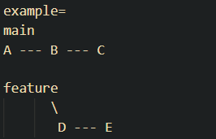

Repository: A folder where Git tracks your project and its history.
Branch: Work on different versions or features at the same time.

1) Know the version post installation -  git --version

2) VS code as default editor - git config --global core.editor "code --wait"

3) Global mail and name - git config --global user.name "Your Name" ; git config --global user.email "you@example.com"

I made a repo on github first and cloned into it to begin with, created a folder called gitclones on my local and started working in that
alternate- just mkdir and git init, init is simply initialise 

4) Which file is pushed and not pushed, tracked or not - git status 

Now the best practice is staging and checking for problems but mostly i can afford pushing the wrong stuff, not interferring with any main branches obv 

5) To stage- Git add {Filename}

6) To unstage- Git restore --staged {filename}

7) To change the message- git commit --amend -m "Corrected message"

8) The Tag, Version adding a tagged bookmark to notify version- git tag -a v1.0 -m "Version 1.0 release"

9) Tag with commit or on specific 1 commit- git tag v1.1 <Commit hash >

10)See all tags- git tag

11) Delete a tag locally- git tag -d v1.0    

12) Delete remote tag- git push origin --delete tag v1.0

13) Difference between staged and in repo-  git diff --staged

14) Compare Two Commits- git diff <commit1> <commit2>

15) Show a Branch Graph- git log --graph or git log --oneline

16) To create a new branch- git branch

17) To switch between branches- git checkout <Branchname(usually main)>

18) To see what is different from main- git status

Build > stage > commit with a quirky message 

Merging only when i am satisfied? 

19) git merge <Branchname> (after checkingout to main)

Switch Branch to main > merge with branch name

20) Deleting a faulty branch- git branch -d <branchname>

The entire ideal workflow- [Working Directory] --git add--> [Staging Area] --git commit--> [Repository]

21) To Undo a commit - git revert HEAD - Revert the latest commit
                   git revert <commit> - Revert a specific commit

22) To go back to a commit (it is like going back  to a version of the branch that was lets say functional and viable)
    git reset --soft <commit> - Move HEAD to commit, keep changes staged
    git reset --mixed <commit> - Move HEAD to commit, unstage changes (default)
    git reset --hard <commit> - Move HEAD to commit, discard all changes

23) To fix a Mistake in the last commit use amend but only for small things, more like  a flag after git commit
    git commit --amend 

24) To move or combine multiple commits - Rebase (Just easier commit history)

25) git checkout feature
26) git rebase main

main
A --- B --- C --- D' --- E'

D ≠ D'
E ≠ E'

just cleaner history with a new commit that just copies D and E into main 

and if Interactive Rebase (Squash)
A --- B --- C --- D

27) git rebase -i HEAD~3

A --- B'

B' will have C and D in it 

Reorder Commits-
A --- B --- C

pick C
pick B

A --- C' --- B'

28) To see which commits have been made by you and to find lost commits - 
    git reflog 
 
29) To recover the file found in reflog - 
    if branch - check branch name (from reflog or log --oneline) 
    and git checkout -b branch-name <commit-hash>
    Switched to a new branch 'branch-name'

30) if file - git restore filename.txt
